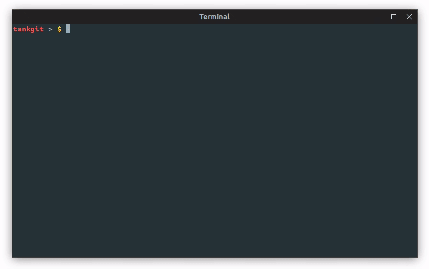

# CheatSheet-manager

`Version 0.1.0`

This is a command line tool to manage your cheatsheet library on your Linux.

It can also be your note-taking manager to note learning pieces.

## Screenshots



## Features

- [x] markdown support
- [x] add/remove/edit your cheatsheets
- [x] search with regex
- [x] view list of your cheatsheets
- [x] bookmark your cheatsheets
- [x] colorful output
- [ ] generate PDF
- [ ] auto-complete
- [ ] export by category/tag/keyword
- [ ] share to Evernote
- [ ] remote cheatsheet library support(personal server or public shared lib)

## Dependencies

- python3.x

## Installation

```bash
git clone https://github.com/tankgit/cheatsheet-manager
cd  cheatsheet-manager
chmod +x install.sh
./install.sh
```

Done. You can start with `chmgr --help` for more info.

## Update

Run 
```bash
git pull
```
to get the latest update.

## Tips

If you meet some errors while using it, please check the following tips first. If it doesn't help, [email me](derektanko@gmail.com) or create issues. 

- I strongly recommend you to add cheatsheet via `chmgr -a`, and do not modify the formats of the head(contents above `---`) of cheatsheets.
- You can modify the values of tags and category in the head, only one category is allowed for each cheatsheet, but tags can be more than one. You can leave it blank, the cheatsheet will be taged with `untaged` automaticly.
- The value of `tags` and `category` should be like this \`tag\`, you should use apostrophe mark rather than single quotation mark. Tags should be seperated by `,`
- If you turn off `AUTO_UPDATE` in config file, you need to update manually for each time modifying your cheatsheets, or the `search` and `bookmark` function may not work correctly. 
- Cheatsheet name should start with a letter or a digit, and only consists of letters, digits and '-','_'.

---
MIT License